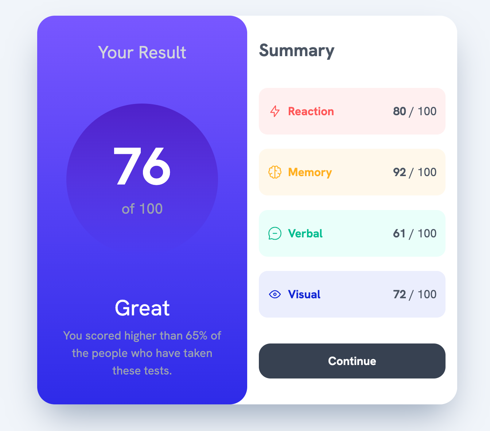
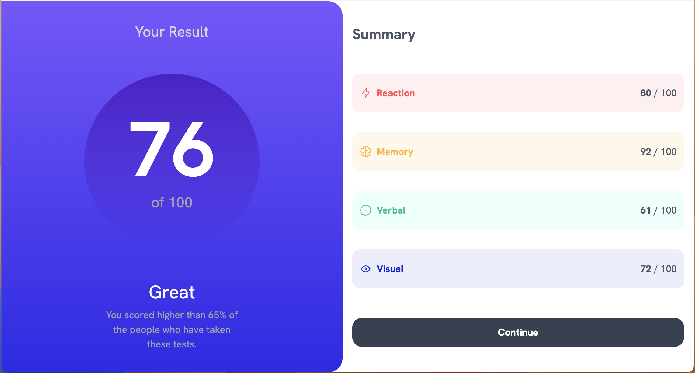
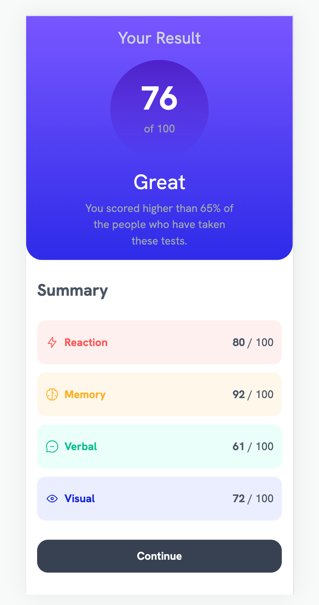

# Frontend Mentor - Results summary component solution

This is a solution to the [Results summary component challenge on Frontend Mentor](https://www.frontendmentor.io/challenges/results-summary-component-CE_K6s0maV). Frontend Mentor challenges help you improve your coding skills by building realistic projects.

## Table of contents

- [Overview](#overview)
  - [The challenge](#the-challenge)
  - [Screenshot](#screenshot)
  - [How to run](#how-to-run)
  - [Links](#links)
- [My process](#my-process)
  - [Built with](#built-with)
  - [Composition](#composition)
- [Author](#author)

This is a [Next.js](https://nextjs.org/) project bootstrapped with [`create-next-app`](https://github.com/vercel/next.js/tree/canary/packages/create-next-app).

## Overview

### The challenge

Users should be able to:

- View the optimal layout for the interface depending on their device's screen size
- See hover and focus states for all interactive elements on the page

### Screenshot

| Destop                                             |                     Tablet                      |                                           Mobile |
| -------------------------------------------------- | :---------------------------------------------: | -----------------------------------------------: |
|  |  |  |

### How to run

First, run the development server:

```bash
npm run dev
# or
yarn dev
# or
pnpm dev
```

### Links

- Live Site URL: [https://cleberpereiradasilva.github.io/results-summary/](https://cleberpereiradasilva.github.io/results-summary/)

### Built with

- CSS custom properties
- Flexbox
- [React](https://reactjs.org/) - JS library
- [Next.js](https://nextjs.org/) - React framework
- [Tailwindcss](https://tailwindcss.com/docs/screens) - For styles
- [Github](https://www.github.com/) - For stored, shared and deploy

### Composition

I used the composition pattern to create the card components.

To see how you can add `Card` components, see below:

```html
<Card.Root>
  <Card.Result />
  <Card.Category />
</Card.Root>
```

If you want more about composition, I recommend checking out [FrontEnd Mastery](https://frontendmastery.com/posts/advanced-react-component-composition-guide/) to learn more.

Open [http://localhost:3000](http://localhost:3000) with your browser to see the result.

## Author

- Website - [Cleber Silva](https://www.clebersilva.dev)
- Frontend Mentor - [@cleberpereiradasilva](https://www.frontendmentor.io/profile/cleberpereiradasilva)
